<p align="center">
  
</p>

<p align="center">
  <a href="https://github.com/ishandutta2007/Awesome-Awesome-Awesome"></a><a href="https://discord.gg/jc4xtF58Ve"></a>
  <a href="https://github.com/ishandutta2007/Awesome-Radiology-Information-Systems/stargazers"></a>
  <a href="https://github.com/ishandutta2007/Awesome-Radiology-Information-Systems/network/members"></a>
  <a href="https://github.com/ishandutta2007/Awesome-Radiology-Information-Systems/pulls"></a>
  <a href="LICENSE"></a>
  <a href="https://github.com/ishandutta2007"></a>
</p>

---

# 🩻 Awesome Radiology Information Systems (RIS)

> A meticulously curated, SEO-optimized directory of **Radiology Information Systems (RIS)**, **Cloud PACS & VNA Platforms**, **DICOM Web Viewers**, **Modality Worklist (MWL) Engines**, and **Open-Source Medical Imaging Software**.

**Radiology Information Systems (RIS)** serve as the operational backbone of modern diagnostic imaging departments, hospital networks, outpatient clinics, and teleradiology practices. While **Picture Archiving and Communication Systems (PACS)** store and transmit digital imaging files (DICOM), a **RIS** directs the complete clinical and business workflow: patient scheduling, modality worklist generation, imaging protocolling, technologist tracking, radiologist dictation and structured reporting, results dissemination, and billing/EHR synchronization (via HL7 and FHIR).

---

## 📑 Table of Contents

- [🌟 Architectural Overview: RIS vs. PACS vs. VNA](#-architectural-overview-ris-vs-pacs-vs-vna)
- [🏢 SaaS & Commercial Hosted Platforms](#-saas--commercial-hosted-platforms)
  - [📊 Market Size & Industry Dynamics](#-market-size--industry-dynamics)
  - [📋 SaaS RIS/PACS Comparison Table](#-saas-rispacs-comparison-table)
- [🔓 Open-Source GitHub Projects](#-open-source-github-projects)
- [🧩 Building a Modern Open-Source Imaging Stack](#-building-a-modern-open-source-imaging-stack)
- [🔍 Key Evaluation Criteria for RIS Buyers](#-key-evaluation-criteria-for-ris-buyers)
- [📈 Star History](#-star-history)
- [🤝 How to Contribute](#-how-to-contribute)
- [⚖️ Disclaimer & Regulatory Compliance](#️-disclaimer--regulatory-compliance)

---

## 🌟 Architectural Overview: RIS vs. PACS vs. VNA

Understanding how modern healthcare imaging components fit together is essential for hospital IT administrators and developers alike:

```
[ Electronic Health Record (EHR) ]
                │  (HL7 ADT / ORM Orders)
                ▼
[ Radiology Information System (RIS) ] ◄── Scheduling, Worklists, Billing, Reporting
                │
                ├──────────────────────┬──────────────────────┐
                │ (DICOM Modality MWL) │ (HL7 ORU Reports)    │ (DICOMweb / WADO-RS)
                ▼                      ▼                      ▼
    [ Modalities (CT/MRI/X-Ray) ]  [ Radiologist Viewer ]  [ Referring Portal ]
                │                              │
                └───────────────┬──────────────┘
                                ▼
               [ Cloud PACS / Vendor Neutral Archive (VNA) ]
```

- **RIS (Radiology Information System)**: Manages patient demographics, order entry, appointment scheduling, DICOM Modality Worklist (MWL) management, reporting workflows, radiologist assignment, and billing capture.
- **PACS (Picture Archiving and Communication System)**: Short-to-medium-term storage, retrieval, distribution, and diagnostic presentation of medical images.
- **VNA (Vendor Neutral Archive)**: Standardized, long-term consolidated enterprise archive that decouples medical data from any proprietary PACS vendor.

---

## 🏢 SaaS & Commercial Hosted Platforms

### 📊 Market Size & Industry Dynamics

> **📈 Sector Market Size & Concentration**: The global Radiology Information Systems (RIS) market is valued at approximately **USD 1.16 Billion to USD 1.47 Billion in 2026** and is projected to expand to **USD 2.18 Billion to USD 2.45 Billion by 2031–2033** (CAGR ~7.5%). The sector demonstrates **moderate market concentration**: the top ten established healthcare IT conglomerates (such as GE HealthCare, Philips, Siemens Healthineers, and Epic) capture roughly **55% of global revenue**, while the remaining 45% is moderately fragmented across specialized outpatient software, teleradiology orchestration systems, and agile cloud-native SaaS startups rather than existing as an impenetrable winner-take-all monopoly.

---

### 📋 SaaS RIS/PACS Comparison Table

*The table below is sorted in **descending order by company size** (market capitalization or annual revenue).*

| Platform | Description & Key Capabilities | Company Size (Valuation / Revenue) | Pricing (Starting Tier) | Free Tier / Free Trial Limit |
| :--- | :--- | :--- | :--- | :--- |
| **[GE HealthCare (Edison True PACS & RIS)](https://www.gehealthcare.com/)** | Cloud-native radiology PACS and workflow orchestration platform with AI-assisted reporting, vendor-neutral routing, and high-volume multi-site clinical scheduling. | **$38B+ Market Cap / $19.6B Revenue** (NASDAQ: GEHC) | Starts at **$500/month** (entry cloud subscription tier for outpatient clinics) | **30-day free trial** (guided proof-of-concept pilot with full workflow and modality connectivity) |
| **[Fujifilm (Synapse RIS/PACS)](https://www.fujifilm.com/)** | Enterprise imaging, VNA, and RIS platform featuring server-side image rendering, comprehensive clinical reporting, and deep multi-departmental EHR integration. | **$30B+ Market Cap / $20.0B Revenue** (TYO: 4901; Healthcare ~$7B) | Starts at **$1,000/month** (base cloud-managed service tier for private practices) | **30-day free trial** (guided clinical evaluation sandbox with modality test connectivity) |
| **[Philips (IntelliSpace / HealthSuite)](https://www.philips.com/)** | Cloud-based enterprise radiology informatics platform offering advanced 3D visualization, intelligent worklist distribution, and longitudinal patient imaging records. | **$28B+ Market Cap / $19.5B Revenue** (NYSE: PHG) | Starts at **$1,200/month** (base diagnostic imaging department cloud tier) | **30-day free trial** (guided cloud evaluation pilot populated with synthetic clinical datasets) |
| **[Visage Imaging (Visage 7)](https://visageimaging.com/)** | High-performance enterprise imaging platform powered by proprietary server-side rendering for instant streaming of massive 3D CT, MRI, and mammography datasets. | **$15B+ Market Cap / $160M+ Revenue** (Parent: Pro Medicus Ltd, ASX: PME) | Starts at **$1,000/month** (base AWS Marketplace cloud instance license tier) | **30-day free trial** (enterprise evaluation pilot with cloud proof-of-concept sandbox) |
| **[Sectra (Workstation & PACS)](https://sectra.com/)** | Consecutive Best-in-KLAS enterprise imaging and RIS/PACS platform renowned for diagnostic stability, breast imaging workflows, and multi-specialty collaboration. | **$5.8B Market Cap / $260M Revenue** (STO: SECT-B) | Starts at **$1,500/month** (Sectra One Cloud entry departmental subscription) | **30-day free trial** (guided evaluation sandbox with simulated diagnostic clinical workflows) |
| **[Ambra Health (Intelerad)](https://www.ambrahealth.com/)** | Cloud-first medical image management suite providing rapid DICOM upload, automated routing, teleradiology worklists, and secure patient/physician image sharing portals. | **~$1.2B Valuation / ~$200M Revenue** (Backed by HGGC & TA Associates) | Starts at **$500/month** (entry cloud tier for outpatient diagnostic centers) | **30-day free trial** (guided cloud sandbox with full diagnostic viewer and image routing) |
| **[Carestream (Vue RIS/PACS)](https://www.carestream.com/)** | Fully web-enabled radiology workflow and archiving platform offering integrated voice recognition, automated worklists, and centralized departmental management. | **~$1.0B+ Revenue** (Global healthcare imaging leader backed by Onex) | Starts at **$750/month** (entry cloud-hosted eHealth services subscription tier) | **30-day free trial** (guided sandbox trial featuring Vue reporting and worklist modules) |
| **[Novarad (NovaRIS & NovaPACS)](https://www.novarad.net/novaris-radiology-information-system)** | Turnkey radiology information system and PACS platform featuring intelligent appointment tracking, custom report templates, and automated insurance pre-authorization. | **~$50M Revenue** (Established private enterprise imaging provider) | Starts at **$400/month** (turnkey Evergreen subscription contract for single facility) | **30-day free trial** (guided evaluation sandbox for clinical workflow qualification) |
| **[RamSoft (OmegaAI)](https://www.ramsoft.com/)** | Cloud-native imaging EMR and RIS/PACS platform (OmegaAI & PowerServer) with progressive image streaming, clinical reporting, and unified modality worklists. | **~$30M Revenue** (Independent medical imaging IT pioneer) | Starts at **$800/month** minimum commitment (~$1.50/study, unlimited users & facilities) | **30-day free trial** (guided proof-of-concept pilot with full RIS/PACS cloud access) |
| **[MedicsRIS (Advanced Data Systems)](https://www.adsc.com/radiology-information-system-medicsris)** | Comprehensive radiology information system providing automated patient scheduling, prior-authorization tracking, multi-modality worklists, and radiologist reporting. | **~$25M Revenue** (Leading healthcare IT automation software vendor) | Starts at **$500/month** (entry tier for single practitioner / 1 user seat) | **14-day free trial** (guided sandbox demo with complete scheduling and reporting suite) |
| **[Tricefy (Trice Imaging)](https://triceimaging.com/)** | Lightweight, zero-footprint medical imaging cloud platform for ultrasound and radiology sharing, mobile diagnostic viewing, remote consultation, and reporting. | **~$12M Revenue / ~$20M+ Funding** (Venture-backed medical cloud platform) | Starts at **$42/month** ($500/year billed annually) or $749/month (Standard tier with 2 TB) | **30-day free trial** (full access to cloud storage, mobile routing, and sharing tools) |
| **[CrelioHealth PACS](https://creliohealth.com/radiology/pacs/pacs-system/)** | Modern cloud radiology reporting and PACS platform featuring automated modality worklists, diagnostic dictation templates, and real-time patient engagement portals. | **~$10M Revenue / ~$5M+ Funding** (Formerly LiveHealth, venture-backed) | Starts at **$50/month** minimum commitment ($0.01/study X-Ray/USG, $0.04 MRI, $0.08 CT) | **14-day free trial** (interactive sandbox demo with full reporting and worklists) |
| **[Softneta MedDream](https://www.softneta.com/products/medical-imaging/meddream-dicom-viewer/)** | FDA 510(k)-cleared and CE-certified HTML5 zero-footprint web DICOM viewer and web-PACS engine designed for modular integration into RIS, HIS, and EHR platforms. | **~$6M Revenue** (European specialized medical imaging vendor) | Starts at **~$130/user/month** (£1,200/user/year commercial license tier) | **45-day trial license** (fully functional diagnostic toolset & APIs); free online web demo |
| **[PostDICOM](https://www.postdicom.com/)** | Cloud PACS and RIS software providing HTML5 diagnostic imaging viewer, multi-device medical data communication, clinical worklists, and secure image sharing. | **~$5M Revenue** (Profitable specialized imaging cloud SaaS) | Starts at **$79/month** (Essential tier; 50 GB storage, HTML5 viewer, 1 user; or $948/yr) | **7-day free trial** (up to 50 GB cloud storage, full diagnostic viewer and plan access) |
| **[OnePacs](https://onepacs.com/)** | Cloud teleradiology and outpatient RIS/PACS platform featuring structured radiologist reporting, unified worklist orchestration, and web-based diagnostic study review. | **~$4M Revenue** (Bootstrapped teleradiology platform provider) | Starts at **$200/month** (minimum base platform tier with volume-tiered study routing) | Free courtesy tier for testing/research (up to **10 studies/month**); **30-day free trial** |
| **[Medicai](https://medicai.io/)** | Collaborative cloud PACS and radiology infrastructure platform offering zero-install web DICOM viewing, patient portal integration, and cloud study archiving. | **~$3M Revenue / ~$3M+ Funding** (Venture-backed cloud medical imaging SaaS) | Starts at **$249/month** ($209/month billed annually; 500 GB storage, unlimited users) | **14-day free trial** (500 GB storage, unlimited accounts); Free tier: browser viewer (0 GB) |
| **[SonicDICOM Cloud PACS](https://sonicdicom.com/)** | Modern web-based DICOM server and Cloud PACS platform featuring real-time image viewing, multi-client access, and easy hardware gateway integration. | **~$2M Revenue** (Specialized medical imaging PACS developer) | Starts at **$39/month** (Basic Plan; monthly or annual subscription) | **14-day free trial** (full access to Cloud PACS features, web viewer, and storage) |

---

## 🔓 Open-Source GitHub Projects

The open-source radiology and imaging software ecosystem provides powerful foundational building blocks—including high-performance diagnostic web viewers, DICOM communication servers, modality worklist tools, and full RIS practice management solutions.

*Sorted in **descending order by GitHub star count**.*

- **[OHIF Viewer](https://github.com/OHIF/Viewers)** [](https://github.com/OHIF/Viewers/stargazers)  
  Leading zero-footprint medical imaging web viewer built with React and Cornerstone3D. Provides an extensible framework for diagnostic review, DICOMweb communication, oncology lesion tracking, and integration with open or commercial RIS worklists.

- **[3D Slicer](https://github.com/Slicer/Slicer)** [](https://github.com/Slicer/Slicer/stargazers)  
  Renowned open-source software platform for medical image computing, multi-modality 3D visualization, advanced segmentation, surgical planning, and PACS query/retrieve operations.

- **[pydicom](https://github.com/pydicom/pydicom)** [](https://github.com/pydicom/pydicom/stargazers)  
  Industry-standard Python package for parsing, reading, modifying, and generating DICOM files. Extensively used in RIS backend integration pipelines, data de-identification, and AI model ingestion.

- **[DWV (DICOM Web Viewer)](https://github.com/ivmartel/dwv)** [](https://github.com/ivmartel/dwv/stargazers)  
  Zero-footprint medical imaging library written in pure HTML5 and JavaScript. Ideal for embedding lightweight DICOM slice navigation and measurement tools inside web-based RIS portals.

- **[Weasis](https://github.com/nroduit/Weasis)** [](https://github.com/nroduit/Weasis/stargazers)  
  High-performance, multiplatform standalone and web-integrated DICOM diagnostic viewer. Widely deployed across European and international clinical hospitals paired with PACS and RIS.

- **[Cornerstone3D](https://github.com/cornerstonejs/cornerstone3D)** [](https://github.com/cornerstonejs/cornerstone3D/stargazers)  
  Next-generation JavaScript library for rendering medical images in web browsers utilizing WebGL/WebGPU. Powers complex 3D volume reconstruction (MPR), oblique slicing, and clinical annotation tools in modern web RIS platforms.

- **[dcm4chee arc light](https://github.com/dcm4che/dcm4chee-arc-light)** [](https://github.com/dcm4che/dcm4chee-arc-light/stargazers)  
  Next-generation DICOM archive, VNA, and Modality Worklist (MWL) management system built on Java EE and WildFly. Serves as a robust backend workhorse connecting modalities to RIS worklists.

- **[dcmjs](https://github.com/dcmjs-org/dcmjs)** [](https://github.com/dcmjs-org/dcmjs/stargazers)  
  JavaScript implementation of DICOM manipulation, DICOMweb protocols, and Structured Reporting (SR) parsing, essential for browser-based radiology tools and reporting interfaces.

- **[DICOM Standard in JSON](https://github.com/innolitics/dicom-standard)** [](https://github.com/innolitics/dicom-standard/stargazers)  
  Automated parser and machine-readable JSON representation of the complete DICOM standard. Invaluable for validating attributes, building robust RIS schemas, and ensuring modality worklist compliance.

- **[Orthanc Mirror](https://github.com/jodogne/OrthancMirror)** [](https://github.com/jodogne/OrthancMirror/stargazers) *(Official Portal: [orthanc-server.com](https://www.orthanc-server.com/))*  
  Lightweight, standalone, RESTful DICOM server and PACS archive written in C++. Offers extensive Lua/Python scripting and DICOMweb plugins, making it the top open-source backend for pairing with web RIS front-ends.

- **[ChRIS Research Integration System](https://github.com/FNNDSC/ChRIS_ultron_backEnd)** [](https://github.com/FNNDSC/ChRIS_ultron_backEnd/stargazers)  
  Open-source distributed framework created by Boston Children's Hospital for orchestrating medical image processing pipelines, deep learning AI models, and clinical research data flows.

- **[Sirius RIS](https://github.com/opendicom/sirius-ris)** [](https://github.com/opendicom/sirius-ris/stargazers)  
  Open-source radiological information system built on Angular, Node.js, and MongoDB. Supports multi-language clinical scheduling, modality worklists, and seamless coupling with open PACS servers.

- **[PACS/RIS Crawler](https://github.com/pacs-ris-crawler/pacs-ris-crawler)** [](https://github.com/pacs-ris-crawler/pacs-ris-crawler/stargazers)  
  Automated search and indexing crawler designed to query, audit, and extract structured diagnostic reports and metadata across federated PACS and RIS installations.

- **[KloudRIS](https://github.com/KloudMedical/KloudRIS)** [](https://github.com/KloudMedical/KloudRIS/stargazers)  
  Open-source, multi-tenant web outpatient RIS and practice management platform intended to oversee full radiology encounters, tracking patient status from check-in to finalized report.

---

## 🧩 Building a Modern Open-Source Imaging Stack

A production-ready open-source radiology infrastructure typically integrates three core layers:

1. **Information & Workflow Layer (RIS)**:
   - Use **Sirius RIS** or **KloudRIS** (or a customized web frontend) to manage patient check-in, modality booking, and diagnostic reporting.
   - Use an integration engine such as **NextGen Connect (Mirth Connect)** to transform HL7 ADT/ORM messages from existing hospital EHRs.
2. **Archival & Communication Layer (PACS/VNA)**:
   - Deploy **Orthanc** or **dcm4chee arc light** with PostgreSQL and Docker/Kubernetes.
   - Implement DICOM Modality Worklist (MWL) services to push patient study orders directly onto scanner consoles (CT, MRI, X-ray, Ultrasound).
3. **Diagnostic Visualization Layer (Viewer)**:
   - Integrate the **OHIF Viewer** (powered by **Cornerstone3D**) or **Weasis** for zero-footprint clinical viewing on workstations, tablets, or referring physician portals.

---

## 🔍 Key Evaluation Criteria for RIS Buyers

When assessing commercial SaaS RIS platforms or building an open-source solution, ensure the following core capabilities are evaluated:

- **Modality Worklist (MWL) Reliability**: Automated push of patient demographics and study accessions to imaging modalities to eliminate manual entry errors.
- **Reporting & Speech Recognition**: Integration with medical dictation tools (Dragon Medical One, 3M M*Modal, or Whisper-based AI transcription) and structured reporting templates.
- **Prior Authorization & Insurance Verification**: Built-in eligibility checks to prevent claim denials and accelerate outpatient billing cycles.
- **Interoperability Standards**: Robust support for HL7 v2, DICOM 3.0, DICOMweb (WADO-RS, QIDO-RS, STOW-RS), and HL7 FHIR ImagingStudy resources.
- **Regulatory Certifications**: HIPAA, GDPR, SOC 2 Type II compliance, and local medical device clearances (such as FDA 510(k) or CE Class IIa for diagnostic viewer components).

---

## 📈 Star History

[](https://star-history.dera.page/#ishandutta2007/Awesome-Radiology-Information-Systems&type=date&legend=top-left)

---

## 🤝 How to Contribute

Contributions from radiology administrators, imaging informatics specialists, PACS admins, and healthcare software engineers are warmly welcomed!

1. 🍴 **Fork the repository**.
2. 🌿 **Create a descriptive feature branch** (`git checkout -b add-ris-platform`).
3. 📝 **Add or update entries** following the established table/list formatting. Ensure all pricing, company size, and free trial limits are explicitly sourced and verified.
4. 🚀 **Submit a Pull Request** with a concise explanation of your additions.

Explore more curated developer lists at **[Awesome Awesome Awesome](https://github.com/ishandutta2007/Awesome-Awesome-Awesome)**!

---

## ⚖️ Disclaimer & Regulatory Compliance

- This repository is a community-curated technical directory for informational and educational purposes only. Mention of specific commercial products or open-source projects does not constitute a clinical endorsement.
- Radiology Information Systems handle Protected Health Information (PHI) and critical diagnostic workflows. Any clinical software deployment must comply with mandatory healthcare standards (including HIPAA, GDPR, HITECH, and regional medical device regulations).
- Open-source tools provide great flexibility but demand experienced healthcare IT administrators for secure deployment, TLS encryption, regular backups, and clinical validation.

---

<p align="center">
  <b>Made with ❤️ for radiologists, PACS administrators, and healthtech software engineers worldwide.</b>
</p>
